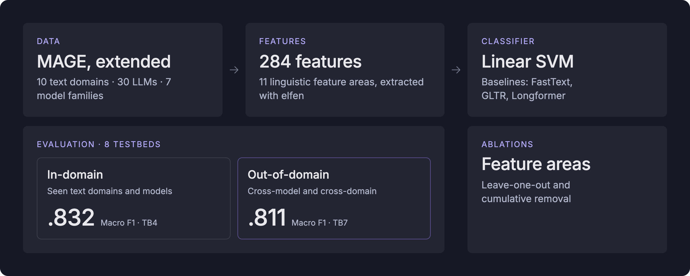

# A Systematic Analysis of Linguistic Features in AI-Generated English Text Detection Across Domains and Models



Code and data for the paper *A Systematic Analysis of Linguistic Features in
AI-Generated English Text Detection Across Domains and Models* (El Attar,
Dönmez, Maurer, and Falenska).

We study how robustly interpretable linguistic features distinguish
LLM-generated from human-written text. Our analysis covers 284 interpretable
linguistic features across outputs from 30 LLMs and 10 text domains, evaluated
under cross-model and cross-domain generalization settings. We find that
classifiers trained solely on linguistic features reliably separate AI-generated
from human-written text, but that many previously proposed indicators are
strongly context-dependent — with the exception of lexical richness, which
remains a robust signal across model families and text domains.

Paper link: [preprint](https://arxiv.org/pdf/2606.04177)

## Overview

The repository contains everything needed to reproduce the experiments:

1. **Data extension.** We adapt the MAGE benchmark (Li et al., 2024) to
   continuation prompts only and extend it with three models released after its
   construction (Llama-3.1-8B, Llama-4-Scout-17B-16E, GLM-5.2), plus GPT-5.6-sol
   for the out-of-distribution test set.
2. **Feature extraction.** 284 interpretable features in eleven areas, extracted
   with the [ELFEN](https://github.com/mmmaurer/elfen) toolkit.
3. **Classification.** Linear SVMs trained and evaluated on eight testbeds that
   vary in generalization scenario, from fixed domain–model pairs to entirely
   unseen domain–model combinations.
4. **Feature-area ablations.** Leave-one-out and cumulative ablations that
   quantify the contribution of each feature area across models and domains.
5. **Baselines.** FastText, GLTR and Longformer, re-trained on the same
   continuation-only extended benchmark.

## Repository structure

```
configs/      Paths, model families, feature groups and the reduced feature set
data/         Corpus location (downloaded separately) — see data/README.md
src/
  data/       Generation scripts for the newly added models
  features/   Feature extraction and consistency checks
  classifiers/SVM classifiers, testbed definitions, ablation studies
  baselines/  FastText, GLTR and Longformer re-implementations
  analysis/   Result readers, figures and LaTeX tables
scripts/      Shell wrappers for the pipeline
results/      Aggregated results behind the paper's tables and figures
notebooks/    Table and figure generation
envs/         Environment specifications for the baselines
```

Each folder has its own README with the details.

## Getting started

```bash
git clone https://github.com/YassirELATTAR/ling-feats-mgt.git
cd ling-feats-mgt

conda create -n ling-feats python=3.10 -y && conda activate ling-feats
pip install -r requirements.txt
pip install https://github.com/explosion/spacy-models/releases/download/en_core_web_lg-3.8.0/en_core_web_lg-3.8.0-py3-none-any.whl
```

Download the corpus (see `data/README.md`) and unpack it into `data/`, then:

```bash
# 1. extract features
python src/features/run_multiple_extractors.py --input data/train/AI/wp --output data_features_prepared --normalize token
python src/features/check_features_consistency.py --root data_features_prepared

# 2. train and evaluate the classifiers
python src/classifiers/classifier_core.py

# 3. ablation studies
python src/classifiers/ablation_study.py
python src/classifiers/cumulative_ablation.py
```

The baselines require separate environments; see `envs/README.md` and
`src/baselines/README.md`.

## Data

The corpus is archived on Zenodo: [10.5281/zenodo.23003160](https://doi.org/10.5281/zenodo.23003160). It contains the human-written texts
and the generations from the 27 original MAGE models, restricted to continuation
prompts, together with our own generations from the four newer models. The
generation scripts in `src/data/` are provided for reference; the released data
already contains all generated samples.

## Citation

```bibtex
@inproceedings{attar2026systematicanalysislinguisticfeatures,
  title     = {A Systematic Analysis of Linguistic Features in AI-Generated
               English Text Detection Across Domains and Models},
  author    = {El Attar, Yassir and D{\"o}nmez, Esra and Maurer, Maximilian
               and Falenska, Agnieszka},
booktitle = {Findings of the Association for Computational Linguistics: AACL 2026},
  year      = {2026}
}
```

Please also cite MAGE (Li et al., 2024), on which the benchmark is based, and
ELFEN (Maurer, 2026), which we use for feature extraction.

## Licence

Code in this repository is released under the Apache License 2.0. The Longformer
baseline reuses code from the [MAGE repository](https://github.com/yafuly/MAGE),
also under Apache 2.0; a copy of its licence is included in `src/baselines/`.
The data remains subject to the terms of the original MAGE release and of the
underlying source corpora.

## Acknowledgments

We acknowledge the support of the Ministerium für Wissenschaft, Forschung und
Kunst Baden-Württemberg (MWK) in Künstliche Intelligenz & Gesellschaft:
Reflecting Intelligent Systems for Diversity, Demography and Democracy
(IRIS3D), and the support by the Interchange Forum for Reflecting on Intelligent
Systems (IRIS) at the University of Stuttgart. We thank the Institute for
Natural Language Processing (IMS), University of Stuttgart, for providing the
computational resources used in this work.

---

*Note: the organisation of this repository — checking consistency across scripts
and the wording of the documentation — was carried out with the assistance of
Claude Opus 4.8 (prompted in May-June 2026) & Claude Opus 5 (prompted in July-September 2026).*
